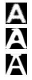
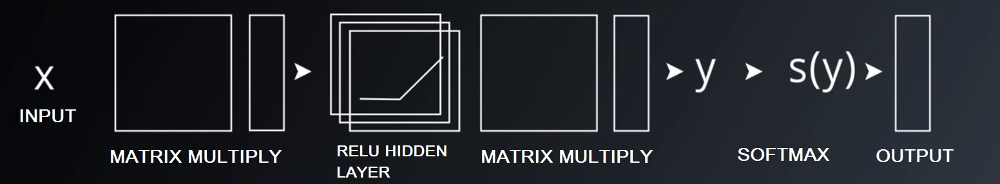

# Tensorflow-Deep-Learning
Contains course assignments for training deep neural networks in Tensorflow.

This project consists of several assignments completed for the [Udacity Deep Learning Course](https://www.udacity.com/course/deep-learning--ud730). The assignments are written in IPython notebooks, and involve Python implementations using the Tensorflow library to **prepare datasets, build and train fully connected and convolutional networks, and apply techniques such as regularization and dropout to optimize networks.** 

This project developed my hands-on experience in file parsing and handling, linear algebra and matrix operations, deep learning theory, and the application of neural networks in Python.

Each assignment is organized by topic:
* [Dataset preperation](#dataset-preperation) .................................(1_notmnist.ipynb)
* [Fully connected neural networks](#fully-connected-neural-networks) .........(2_fullyconnected.ipynb)
* [Regularization](#regularization) ...........................................(3_regularization.ipynb)
* [Convolutional neural networks](#convolutional-neural-networks) .............(4_convolutions.ipynb)

## Dataset preperation
In this assignment, I download and sort the notMNIST dataset, which consists of handwritten letters from A-J with ~50,000 samples for each letter. The dataset is then compressed for storage and easy withdrawal for future tasks. Shown below are some samples images of the data:

## Fully connected neural networks
Involves building the architecture of a simple neural network. Though simple, this implementation utilizes weights corresponding to every input in the matrix multiplication (and is thus fully connected) and inserts a non-linear ReLU operation in between the two layers, increasing the capacity of the network to generalize to new examples. Shown below is the architecture used:

## Regularization 
In this assignment I add regularization techniques to the fully connected neural network. Applying regularization techniques prevents overfitting, in which a neural network recognizes the training set too well and fails to classify different examples. 

## Convolutional Neural Networks
I replace the fully connected neural network from previous implementations with a new architecture known as a convolutional neural network. This architecture makes use of parameter sharing, meaning that inputs are trained on the same weights. This allows for drastically less parameters and thus requires less memory and computation time while also increasing accuracy when generalizing to new examples. 
